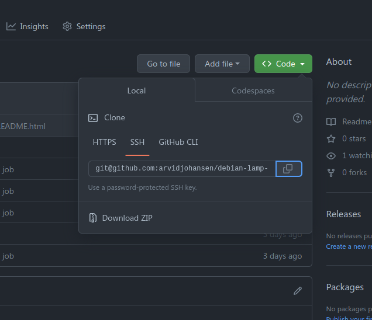

# debian-lamp-howto

**Before you start this step, make sure you have completed the installation of Debian 11.7 and are able to log in both as root and your desired username.**

This is a step by step instruction on how to install the infamous LAMP-stack (Linux Apache MariaDB PHP) on Debian 11.7.

https://wiki.debian.org/LaMp - we're following the official Debian guide (mostly)

We will be skipping some steps to focus on a minimal viable solution

Just type in the commands

---

## Commands

Update the system:

```bash
apt update && apt upgrade
```

---

### Install MariaDB

```console
apt install mariadb-server mariadb-client
# mysql_secure_installation #uncomment this line for improved security
```

---

### Create database and user

You should create 1 user that has full access to 1 db with the same name. 

Replace `wiki` with your preferred databasename / username

Optionally replace `localhost` with the IP-address of your database client (for example a webserver)

```sql
CREATE DATABASE wiki;
CREATE USER 'wiki'@'localhost' IDENTIFIED BY 'Yolo123456';
GRANT ALL PRIVILEGES ON wiki.* TO 'wiki'@'localhost';
FLUSH PRIVILEGES;
```

---

### Apache

```console
apt install apache2 apache2-doc
systemctl restart apache2
systemctl enable apache2
```

---

### PHP

```bash
apt install php php-mysql
```

---

 ### PHPMyAdmin

```bashgit@github.com:arvidjohansen/debian-lamp-howto.git
apt install phpmyadmin
echo "Include /etc/phpmyadmin/apache.conf" >> /etc/apache2/apache2.conf # activate it
systemctl restart apache2
```

Congratiulations, it should now be running!

Now all you have to do is copy your files over, good luck!

---

## Copying files to the server

There are basically 2 ways to copy our files over to the server.

1. Using `scp` aka "secure copy" to manually move the files we need from our host-pc to the web-server
1. Installing `git` on the server and manually pulling our repository over

---

### Copying over files using `scp`

`scp` stands for "secure copy" and is a unix-based tool to copy files between UNIX-like and Linux-based systems.

In recent versions of Windows 10, **scp now comes as default with windows**, you can check to see if you have it by typing `scp` in the command line.

The great thing about scp is that it uses only port 22 aka SSH to copy the files over. Which is great since we already have that service running.

The syntax of `scp` is a mix between `cp` (normal copy which takes in 2 parameters: `source` and `destination`), and `ssh` which uses the `username`@`hostname` syntax.

---

So lets say that I am on my Windows-system and I want to copy over the folder `wiki`. The command I would use is:

```console
scp wiki arvidj@<ip of server>:
```

Notice the `:` in the end.

Now we can verify that the files have been moved over by using `ls` in our home directory on the server.

---

Now that we have copied our application-files to our home-folder, the full path to our application is `/home/arvidj/wiki`. 

All we have to do now is to point the current root of the webserver (`/var/www/html`) to this directory. This can be done by logging in as root `sudo -i` and then making a link from the current root-directory to our newly clone git repo.

```
ln -s /home/arvidj/wiki/ /var/www/html
```

---

Now after you restart the apache2-service, the files should be served by the web-server. You can test this by accessing the web-server `http://<ip of web-server>/name of project`

Great success!

>Remember that you will have to create the tables in your database or it will not work!

---

### Copy over files using git (dont do this)

It is generally a bad idea to use git to clone our repository to our new server. The reason for this is that git can be a bit quirky when configuring/using for the first time and it can make our job - which is to simply **copy our application over from our host-pc to the server** - unneccesarily complicated. 

I highly recommend that you use `scp` or `winscp` to copy the files over to the webserver.

---

Now we must install git on our new server

```
apt install git
```

---

Now we copy the url to our repository on github:



---

... and clone it on our server after we have logged in via SSH.

```
git clone git@github.com:arvidjohansen/debian-lamp-howto.git
```

---

>IMPORTANT! You have to connect your current user to your Git-account by running `ssh-keygen` and copy-pasting the `.ssh/id_rsa.pub` to the `SSH and GPG-keys`-section in the settings of your `github.com`-account. This is something we always must do to authorize our git client so that it can actually access our repo. 

---

